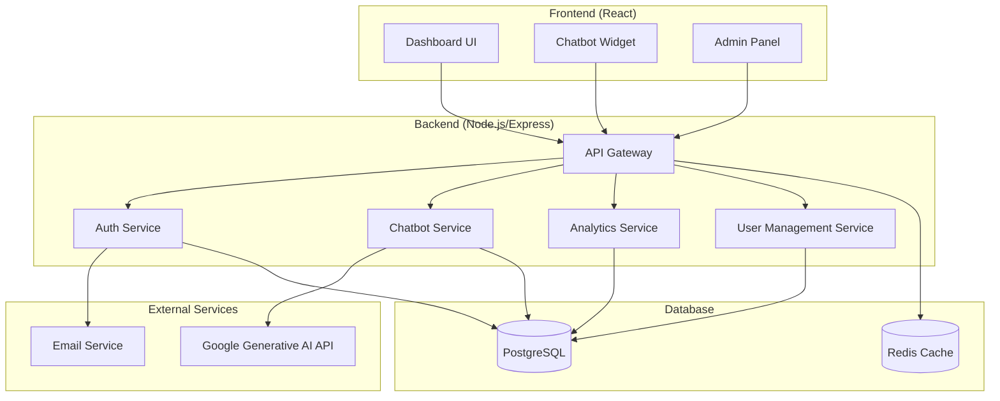

# Design Document

## Overview

The AI Chatbot SaaS platform will be built using the PERN stack with a microservices-oriented architecture to ensure scalability and maintainability. The system will integrate with Google's Generative AI API for AI capabilities. The platform will support multi-tenancy with user-based access controls, operating on a free tier model for all users.

## Architecture

### High-Level Architecture



### Technology Stack

- **Frontend**: React 18 with TypeScript, Vite for build tooling, Tailwind CSS for styling
- **Backend**: Node.js with Express.js, TypeScript for type safety
- **Database**: PostgreSQL for primary data, Redis for caching and session management
- **Authentication**: JWT tokens with refresh token rotation
- **AI Integration**: Google Generative AI API (Gemini) for chatbot responses
- **Deployment**: Docker containers with orchestration support

## Components and Interfaces

### Frontend Components

#### Dashboard Application
- **User Management**: Registration, login, profile management
- **Chatbot Builder**: Visual interface for creating and customizing chatbots
- **Analytics Dashboard**: Usage metrics, conversation insights, performance data
- **Account Management**: Profile settings, usage monitoring, data export
- **Integration Tools**: Embed code generation, API documentation

#### Embeddable Chat Widget
- **Lightweight React Component**: Minimal bundle size for fast loading
- **Customizable UI**: Theming, branding, positioning options
- **Real-time Communication**: WebSocket connection for instant responses
- **Responsive Design**: Mobile and desktop compatibility

### Backend Services

#### API Gateway
```typescript
interface APIGateway {
  authenticate(request: Request): Promise<User | null>
  rateLimit(userId: string, endpoint: string): Promise<boolean>
  routeRequest(request: Request): Promise<Response>
  logRequest(request: Request, response: Response): void
}
```

#### Authentication Service
```typescript
interface AuthService {
  register(email: string, password: string): Promise<User>
  login(email: string, password: string): Promise<AuthTokens>
  refreshToken(refreshToken: string): Promise<AuthTokens>
  verifyEmail(token: string): Promise<boolean>
  resetPassword(email: string): Promise<void>
}
```

#### Chatbot Service
```typescript
interface ChatbotService {
  createChatbot(userId: string, config: ChatbotConfig): Promise<Chatbot>
  updateChatbot(chatbotId: string, config: Partial<ChatbotConfig>): Promise<Chatbot>
  processMessage(chatbotId: string, message: string, context: ConversationContext): Promise<ChatResponse>
  trainChatbot(chatbotId: string, trainingData: TrainingData[]): Promise<void>
  getChatbotAnalytics(chatbotId: string, timeRange: TimeRange): Promise<Analytics>
}
```

#### User Management Service
```typescript
interface UserManagementService {
  getUserProfile(userId: string): Promise<UserProfile>
  updateUserProfile(userId: string, profile: Partial<UserProfile>): Promise<UserProfile>
  getUserUsageStats(userId: string): Promise<UsageStats>
  exportUserData(userId: string): Promise<UserDataExport>
  deleteUserAccount(userId: string): Promise<void>
}
```

## Data Models

### User Model
```typescript
interface User {
  id: string
  email: string
  passwordHash: string
  firstName: string
  lastName: string
  emailVerified: boolean
  createdAt: Date
  updatedAt: Date
}
```

### Chatbot Model
```typescript
interface Chatbot {
  id: string
  userId: string
  name: string
  description: string
  personality: string
  knowledgeBase: string[]
  appearance: ChatbotAppearance
  settings: ChatbotSettings
  isActive: boolean
  createdAt: Date
  updatedAt: Date
}

interface ChatbotAppearance {
  primaryColor: string
  secondaryColor: string
  fontFamily: string
  borderRadius: number
  position: 'bottom-right' | 'bottom-left' | 'center'
  avatar?: string
}

interface ChatbotSettings {
  maxTokens: number
  temperature: number
  responseDelay: number
  fallbackMessage: string
  collectUserInfo: boolean
}
```

### Conversation Model
```typescript
interface Conversation {
  id: string
  chatbotId: string
  sessionId: string
  messages: Message[]
  userInfo?: UserInfo
  startedAt: Date
  endedAt?: Date
}

interface Message {
  id: string
  role: 'user' | 'assistant'
  content: string
  timestamp: Date
  metadata?: Record<string, any>
}
```

### Usage Tracking Model
```typescript
interface UsageStats {
  userId: string
  messagesThisMonth: number
  totalMessages: number
  chatbotsCreated: number
  storageUsed: number
  lastActive: Date
  createdAt: Date
  updatedAt: Date
}

interface UserProfile {
  id: string
  email: string
  firstName: string
  lastName: string
  preferences: UserPreferences
  usage: UsageStats
}

interface UserPreferences {
  theme: 'light' | 'dark'
  notifications: boolean
  language: string
  timezone: string
}
```

## Error Handling

### Error Types
- **ValidationError**: Input validation failures
- **AuthenticationError**: Authentication and authorization failures
- **RateLimitError**: API rate limit exceeded
- **AIServiceError**: Google Generative AI API integration failures
- **DatabaseError**: Database connection and query failures

### Error Response Format
```typescript
interface ErrorResponse {
  error: {
    code: string
    message: string
    details?: Record<string, any>
    timestamp: Date
  }
}
```

### Error Handling Strategy
- **Client-side**: User-friendly error messages with retry options
- **Server-side**: Comprehensive logging with error tracking service integration
- **Graceful Degradation**: Fallback responses when Google AI service is unavailable
- **Circuit Breaker**: Prevent cascade failures in external service integrations

## Testing Strategy

### Unit Testing
- **Frontend**: Jest and React Testing Library for component testing
- **Backend**: Jest for service and utility function testing
- **Database**: In-memory PostgreSQL for isolated database testing
- **Coverage Target**: Minimum 80% code coverage

### Integration Testing
- **API Testing**: Supertest for endpoint testing with test database
- **External Service Mocking**: Mock Google Generative AI API for predictable testing
- **Database Integration**: Test database migrations and complex queries
- **Authentication Flow**: End-to-end authentication and authorization testing

### End-to-End Testing
- **User Workflows**: Playwright for critical user journey testing
- **Chatbot Integration**: Test embed widget functionality across different websites
- **User Management**: Test account creation, profile management, and data export
- **Performance Testing**: Load testing for concurrent chatbot conversations

### Security Testing
- **Authentication**: Test JWT token handling and refresh mechanisms
- **Authorization**: Verify proper access controls for multi-tenant data
- **Input Validation**: Test for SQL injection, XSS, and other common vulnerabilities
- **Rate Limiting**: Verify API rate limiting and abuse prevention