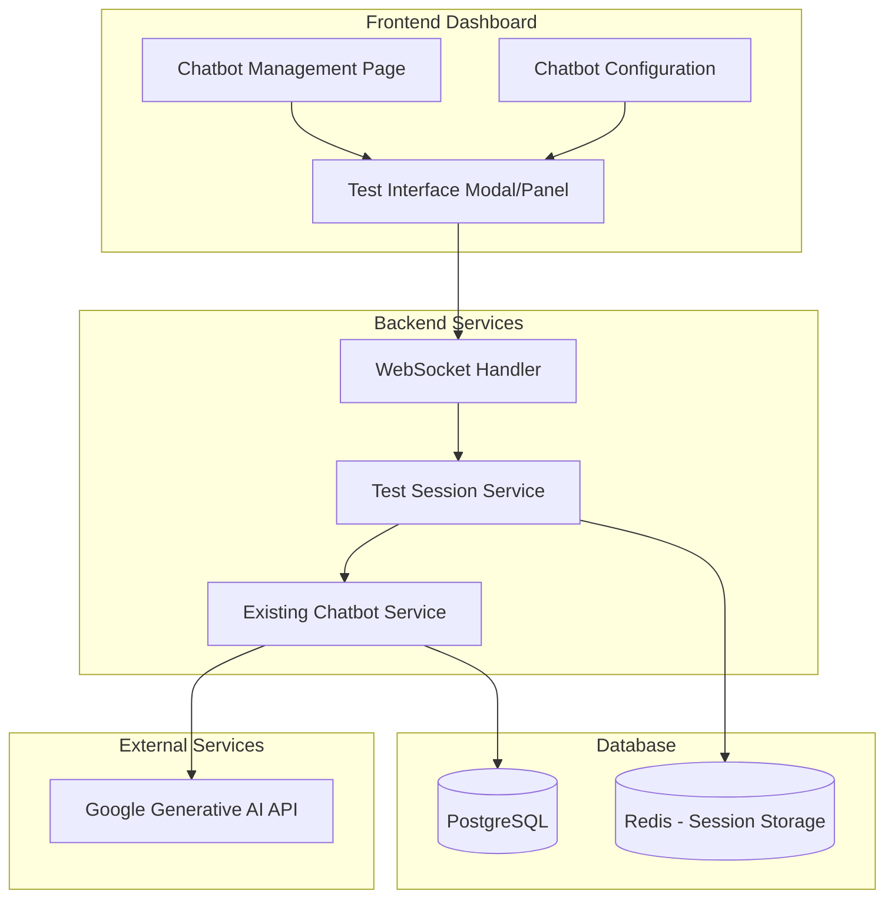

# Design Document

## Overview

The chatbot testing interface will be integrated into the existing AI Chatbot SaaS platform dashboard, providing users with an in-dashboard chat experience that mirrors the embedded widget functionality. The design focuses on seamless integration with the existing chatbot management system while providing a robust testing environment with debugging capabilities.

## Architecture

### Integration with Existing System



### Component Architecture

The testing interface will reuse existing chatbot infrastructure while adding test-specific features:

- **Test Session Management**: Isolated test conversations that don't affect production analytics
- **Real-time Communication**: WebSocket connection for instant message exchange
- **Configuration Sync**: Live updates when chatbot settings change
- **Debug Information**: Optional metadata display for troubleshooting

## Components and Interfaces

### Frontend Components

#### Test Interface Modal/Panel
```typescript
interface TestInterfaceProps {
  chatbotId: string
  isOpen: boolean
  onClose: () => void
  debugMode?: boolean
}

interface TestInterfaceState {
  messages: TestMessage[]
  isLoading: boolean
  sessionId: string
  debugInfo?: DebugInfo
}
```

#### Chat Message Component
```typescript
interface TestMessage extends Message {
  debugInfo?: {
    responseTime: number
    tokensUsed: number
    knowledgeBaseHits: string[]
    confidence: number
  }
}
```

#### Test Controls Panel
```typescript
interface TestControlsProps {
  onReset: () => void
  onToggleDebug: () => void
  onGetEmbedCode: () => void
  debugMode: boolean
  chatbotConfig: ChatbotConfig
}
```

### Backend Services

#### Test Session Service
```typescript
interface TestSessionService {
  createTestSession(chatbotId: string, userId: string): Promise<TestSession>
  processTestMessage(sessionId: string, message: string): Promise<TestResponse>
  resetTestSession(sessionId: string): Promise<void>
  getTestSession(sessionId: string): Promise<TestSession>
  cleanupExpiredSessions(): Promise<void>
}

interface TestSession {
  id: string
  chatbotId: string
  userId: string
  messages: TestMessage[]
  createdAt: Date
  lastActivity: Date
  debugMode: boolean
}

interface TestResponse {
  message: string
  debugInfo?: {
    responseTime: number
    tokensUsed: number
    knowledgeBaseHits: string[]
    confidence: number
    modelUsed: string
  }
}
```

#### WebSocket Test Handler
```typescript
interface WebSocketTestHandler {
  handleTestConnection(socket: WebSocket, sessionId: string): void
  handleTestMessage(socket: WebSocket, message: TestMessagePayload): Promise<void>
  handleTestReset(socket: WebSocket, sessionId: string): Promise<void>
  broadcastConfigUpdate(chatbotId: string, config: ChatbotConfig): void
}
```

## Data Models

### Test Session Model
```typescript
interface TestSession {
  id: string
  chatbotId: string
  userId: string
  messages: TestMessage[]
  debugMode: boolean
  createdAt: Date
  lastActivity: Date
  expiresAt: Date
}
```

### Test Message Model
```typescript
interface TestMessage {
  id: string
  sessionId: string
  role: 'user' | 'assistant'
  content: string
  timestamp: Date
  debugInfo?: TestDebugInfo
}

interface TestDebugInfo {
  responseTime: number
  tokensUsed: number
  knowledgeBaseHits: string[]
  confidence: number
  modelUsed: string
  errorInfo?: string
}
```

## User Interface Design

### Test Interface Layout

```
┌─────────────────────────────────────────────────────────┐
│ Test Chatbot: "Customer Support Bot"            [X]     │
├─────────────────────────────────────────────────────────┤
│ [Reset Chat] [Debug Mode: ON] [Get Embed Code]         │
├─────────────────────────────────────────────────────────┤
│                                                         │
│  👤 Hello! How can I help you today?                   │
│                                                         │
│      Hi, I need help with my order        🧑‍💻          │
│                                                         │
│  👤 I'd be happy to help with your order!              │
│     What's your order number?                          │
│     ⏱️ 1.2s | 🔢 45 tokens | 📚 order_help.md         │
│                                                         │
│      My order number is 12345             🧑‍💻          │
│                                                         │
│  👤 Let me look that up for you...                     │
│     ⏱️ 0.8s | 🔢 32 tokens | 📚 order_lookup.md       │
│                                                         │
├─────────────────────────────────────────────────────────┤
│ Type your message...                    [Send]          │
└─────────────────────────────────────────────────────────┘
```

### Integration Points

#### Chatbot Management Page
- Add "Test" button next to each chatbot in the list
- Add "Test Chatbot" button in the chatbot edit/configuration page
- Show test status indicator (active test sessions)

#### Configuration Sync
- Real-time updates when chatbot settings change during testing
- Visual indicators when configuration is out of sync
- Option to refresh test session with new settings

## Error Handling

### Test-Specific Error Scenarios
- **Session Expiration**: Graceful handling of expired test sessions
- **Configuration Conflicts**: Handle cases where chatbot config changes during testing
- **AI Service Failures**: Show debug information for API failures
- **WebSocket Disconnection**: Automatic reconnection with session recovery

### Error Display Strategy
```typescript
interface TestError {
  type: 'session_expired' | 'config_conflict' | 'ai_service_error' | 'connection_error'
  message: string
  recoveryAction?: 'refresh' | 'reset' | 'reconnect'
  debugInfo?: Record<string, any>
}
```

## Testing Strategy

### Unit Testing
- **Test Session Service**: Session creation, message processing, cleanup
- **WebSocket Handler**: Connection management, message routing
- **Frontend Components**: Chat interface, controls, error states
- **Configuration Sync**: Real-time updates and conflict resolution

### Integration Testing
- **End-to-End Chat Flow**: Complete conversation testing with AI responses
- **Configuration Changes**: Test behavior when chatbot settings change during testing
- **Session Management**: Multi-user, multi-chatbot session isolation
- **WebSocket Communication**: Real-time messaging reliability

### User Experience Testing
- **Performance**: Response times and interface responsiveness
- **Visual Consistency**: Ensure test interface matches embedded widget appearance
- **Accessibility**: Keyboard navigation and screen reader compatibility
- **Mobile Responsiveness**: Test interface usability on different screen sizes

## Security Considerations

### Session Security
- **Session Isolation**: Ensure test sessions are properly isolated between users
- **Data Privacy**: Test conversations should not be stored permanently
- **Rate Limiting**: Prevent abuse of test interface for excessive AI usage
- **Authentication**: Verify user ownership of chatbots being tested

### Debug Information Security
- **Sensitive Data**: Ensure debug info doesn't expose sensitive configuration
- **API Keys**: Never expose Google AI API keys in debug information
- **User Data**: Protect any user information in knowledge base hits

## Performance Considerations

### Optimization Strategies
- **Session Cleanup**: Automatic cleanup of expired test sessions
- **Message Limits**: Reasonable limits on test conversation length
- **Caching**: Cache chatbot configuration for active test sessions
- **WebSocket Efficiency**: Optimize real-time communication overhead

### Scalability
- **Concurrent Sessions**: Support multiple simultaneous test sessions per user
- **Resource Management**: Efficient memory usage for test session storage
- **Load Balancing**: Distribute WebSocket connections across servers
- **Database Optimization**: Efficient queries for test session management